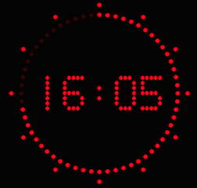

# StudioClock

A simple Python script using [Pygame](http://www.pygame.org) to display a studio clock.

Copyright (C) 2015 Pascal Hurni <[https://github.com/phurni](https://github.com/phurni)>

Licensed under the [MIT License](http://opensource.org/licenses/MIT).

## Using

Place the content anywhere you like on your system. Have python with pygame installed.

Run it simply:

    python studioclock.py

## Customizing

Look at the constants at the begginning of the script, tweak anything like:

  * window size
  * time color, font, size and format (using time.strftime format)
  * tick colors, size
  
The `*_HUE_STEP` constants may be set to zero, this will keep the same color. Putting other values will
add a sliding color effect (higher for faster) on the item.
